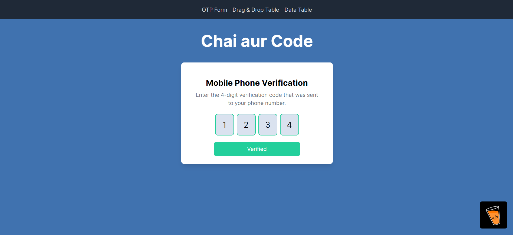
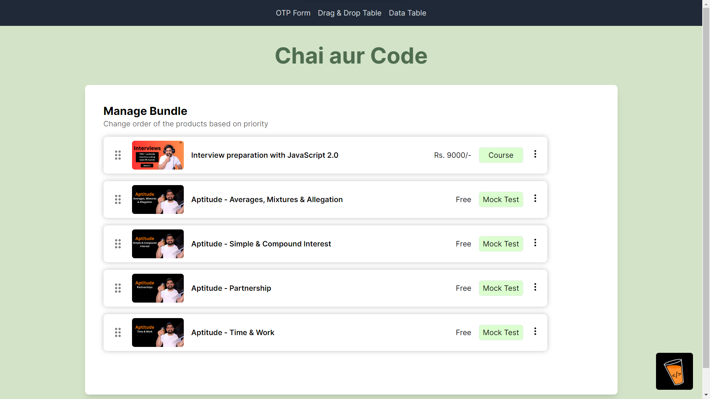
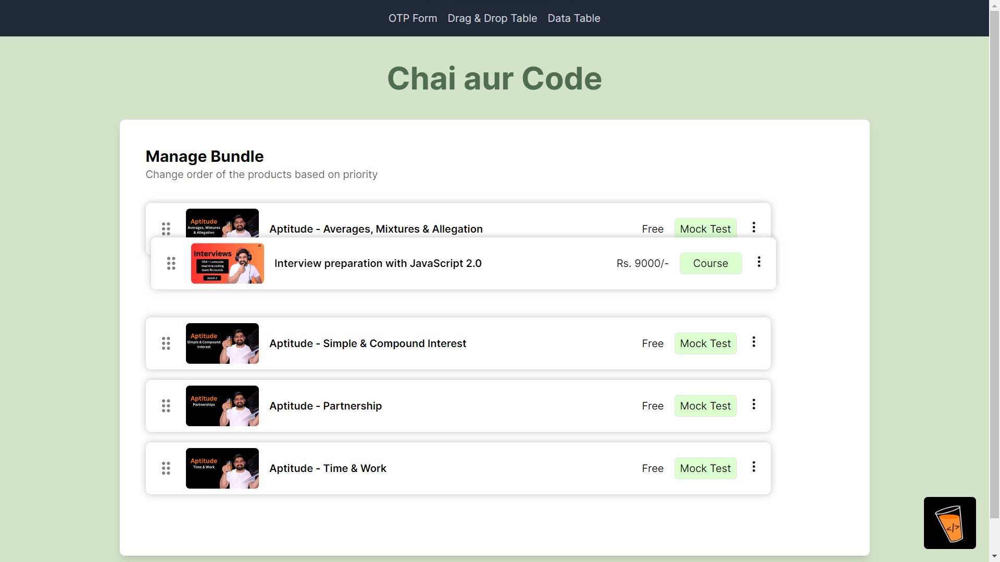

# 01 Machine Coding Round (React)

A React project with three main tasks: OTP Form, Drag and Drop Course Cards, and Data Table. This project is implemented using React and aims to precisely align with the provided Figma designs.

## Table of Contents
- [OTP Form](#otp-form)
- [Drag and Drop Course Cards](#drag-and-drop-course-cards)
- [Data Table](#data-table)
- [Project Setup](#project-setup)


## 📝 OTP Form 

**Empty Form State:** A form to input a 4-digit OTP


**Filling State:** The state during the input of the OTP


**Filled State (Success):** The state when the OTP is correctly filled


**Filled State (Error):** The state when the OTP is incorrectly filled


## 🫳🏻 Drag and Drop Cards

Implemented a list of vertical course cards using `react-beautiful-dnd` library
<br/>
Each card should have actions for `Move to Top`, `Move to Bottom`, and `Remove`






## 📑 Data Table

## ⚙️ Project Setup

To get started with this project, clone the repository and install the necessary dependencies:

```bash
git clone https://github.com/your-repo/masterji.git
cd masterji
npm install
npm start
