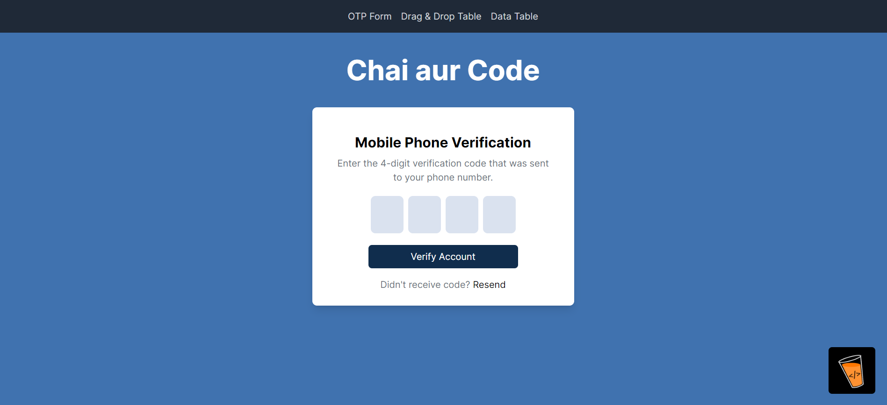

# 01 Machine Coding Round (React)

A React project with three main tasks: OTP Form, Drag and Drop Course Cards, and Data Table. This project is implemented using React and aims to precisely align with the provided Figma designs.

## Table of Contents
- [OTP Form](#otp-form)
- [Drag and Drop Course Cards](#drag-and-drop-course-cards)
- [Data Table](#data-table)
- [Project Setup](#project-setup)


## 📝 OTP Form 

### This is a React component named `OTPForm` that represents a mobile phone verification form with a 4-digit OTP input.  Here's a breakdown of what the code is doing:

- **Empty Form State:** A form to input a 4-digit OTP



- **Filling State:** The state during the input of the OTP


- **Filled State (Success):** The state when the OTP is correctly filled


- **Filled State (Error):** The state when the OTP is incorrectly filled


## 🫳🏻 Drag and Drop Cards

### This feature allows users to manage a list of vertical course cards using the `react-beautiful-dnd` library. Users can move cards to the top or bottom of the list or remove them entirely.
  
- **Vertical Course Cards:** Display a list of draggable course cards.


- **Card Actions:** Each card includes actions for:
  - Move to Top
  - Move to Bottom
  - Remove


## 📑 Data Table

### The Data Table component displays tabular data and supports various operations such as sorting, filtering, and pagination.

- **Data Display:** Render tabular data with columns and rows.
- **Sorting and Filtering:** Allow sorting and filtering of data based on column values.
- **Pagination:** Provide pagination controls for navigating through data.


## ⚙️ Project Setup

To get started with this project, clone the repository and install the necessary dependencies:

```bash
git clone https://github.com/swamiabhishek45/01MachineCodingRound-React-.git

cd 01MachineCodingRound-React-

npm install

npm run dev
